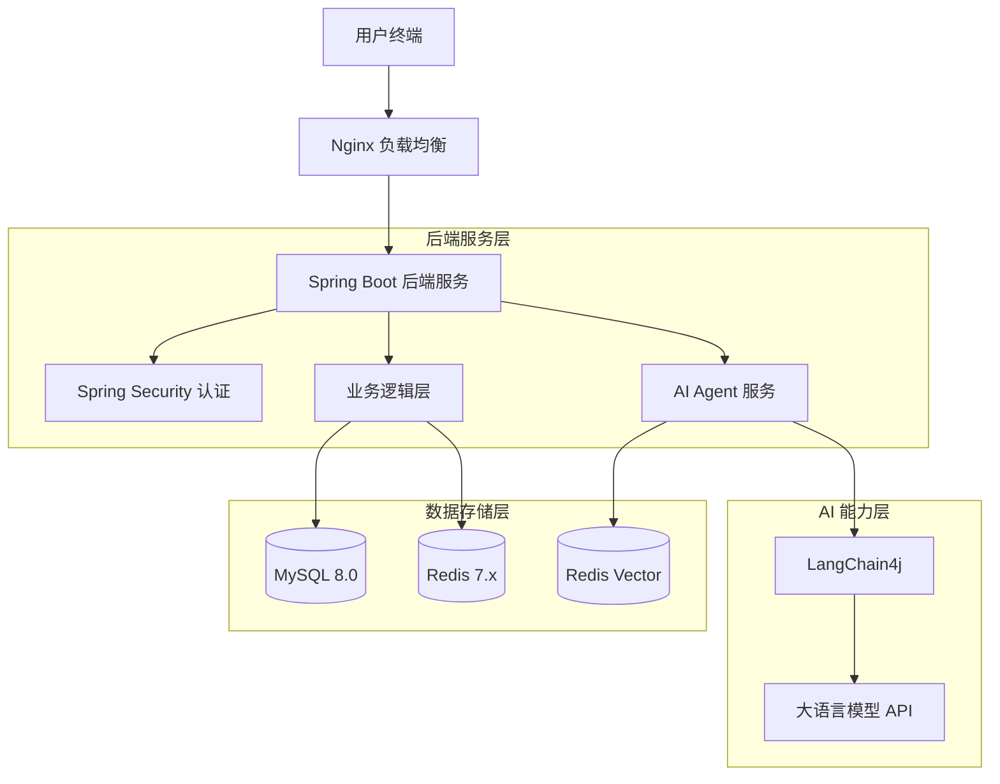

# 智能AI足球社区论坛 (Smart AI Football Community)


## 📖 项目概述

**智能AI足球社区论坛**是一个基于现代前后端分离架构的垂直领域社交平台，专为足球爱好者打造。本项目深度融合 AI 技术，通过 LangChain4j 框架接入大语言模型，实现了智能足球评论员、赛后战报自动生成和社区内容智能审计等创新功能。

### 核心亮点
- **垂直深耕**: 专注足球领域，提供赛事数据、球队资料、球员档案等深度内容。
- **AI 赋能**: 
  - **智能评论员**: 基于实时数据的多风格赛事解说。
  - **智能战报**: 自动生成结构化的赛后分析报告。
  - **内容审计**: AI 辅助的敏感内容过滤与垃圾信息识别。
- **全端覆盖**: 采用 Uni-app 开发，支持微信小程序及移动端 H5。

---

## 🏗 技术架构

### 整体架构
采用前后端分离的单体架构，支持容器化部署。



### 技术栈

| 领域 | 技术组件 | 说明 |
|------|----------|------|
| **后端** | Spring Boot 3.2 | 核心框架 |
| | MyBatis-Plus | ORM 框架 |
| | Spring Security + JWT | 认证授权 |
| | Redis 7.x | 缓存与消息队列 |
| **前端** | Uni-app (Vue3) | 跨平台开发框架 |
| | uView Plus | UI 组件库 |
| **AI** | LangChain4j | Java AI 应用框架 |
| | OpenAI / Qwen | 大语言模型支持 |
| **运维** | Docker & Compose | 容器化部署 |
| | Jenkins | CI/CD (规划中) |

---

## ⚡ 快速开始

### 环境要求
- **JDK**: 17+
- **Maven**: 3.8+
- **Node.js**: 18+ (用于前端编译)
- Docker: 建议安装 Docker Desktop 以快速启动中间件

### 🚀 一键启动 (Trae/VS Code)
推荐直接在 IDE 内部运行，无需弹出黑框：
1. 按下快捷键 `Ctrl + Shift + B` (Windows)。
2. 选择 **"🚀 一键启动所有服务 (Start All)"**。
3. 稍等片刻，IDE 下方的终端面板将自动分屏运行后端和前端服务。

### 💻 一键启动 (Windows 外部运行)
如果不使用 IDE，可以直接运行项目根目录下的脚本：
- 双击 `start_dev.bat`：自动启动后端 (Spring Boot) 和前端 (H5模式) 服务。

### 1. 启动基础设施
使用 Docker Compose 启动 MySQL 和 Redis：

```bash
cd docker
docker-compose up -d
```

### 2. 后端启动
1. 克隆仓库：
   ```bash
   git clone https://github.com/your-repo/football-community.git
   ```
2. 导入数据库脚本：
   - 执行 `soccer-forum-parent/sql/` 目录下的脚本初始化表结构。
3. 修改配置 `application.yml`：
   ```yaml
   spring:
     datasource:
       url: jdbc:mysql://localhost:3306/soccer_forum
       username: root
       password: your_password
     ai:
       openai:
         api-key: your_sk_key  # 配置 AI API Key
   ```
4. 运行主程序：
   ```bash
   mvn spring-boot:run
   ```

### 3. 前端启动
1. 进入前端目录：
   ```bash
   cd frontend
   ```
2. 安装依赖：
   ```bash
   npm install
   ```
3. 运行开发服务（H5模式）：
   ```bash
   npm run dev:h5
   ```
   或在 HBuilderX 中打开项目运行至微信小程序模拟器。

---

## 🛡 安全设计

本项目实施了多层级的安全防护措施：

1. **认证与授权**
   - 全局启用 **HTTPS** 加密传输。
   - 基于 **JWT (JSON Web Token)** 的无状态认证机制。
   - **RBAC** 权限模型，细粒度控制接口访问权限（用户、版主、管理员）。

2. **数据安全**
   - 用户密码采用 **BCrypt** 强哈希存储。
   - 敏感信息（如手机号、邮箱）在数据库中脱敏存储。
   - 配置 Redis 密码认证，防止未授权访问。

3. **应用安全**
   - **SQL 注入防护**: 使用 MyBatis-Plus 预编译 SQL。
   - **XSS 防护**: 统一过滤输入内容，转义特殊字符。
   - **限流熔断**: 集成 RateLimiter 防止恶意刷接口。
   - **内容风控**: 接入 AI 审核模型，自动识别并拦截违规文本与图片。

---

## 📅 开发计划

详细的开发任务与进度请参考 [DEV_PLAN.md](./DEV_PLAN.md)。

- [x] **v1.0 MVP**: 基础社区功能、用户体系 (进行中)
- [ ] **v2.0 垂直深化**: 赛事数据、资讯流
- [ ] **v3.0 AI 升级**: 智能解说、智能战报

---

## 🤝 贡献指南

欢迎提交 Issue 和 Pull Request！

1. Fork 本仓库
2. 创建特性分支 (`git checkout -b feature/AmazingFeature`)
3. 提交更改 (`git commit -m 'Add some AmazingFeature'`)
4. 推送到分支 (`git push origin feature/AmazingFeature`)
5. 提交 Pull Request

## 📄 开源协议

本项目采用 [Apache License 2.0](LICENSE) 协议开源。
